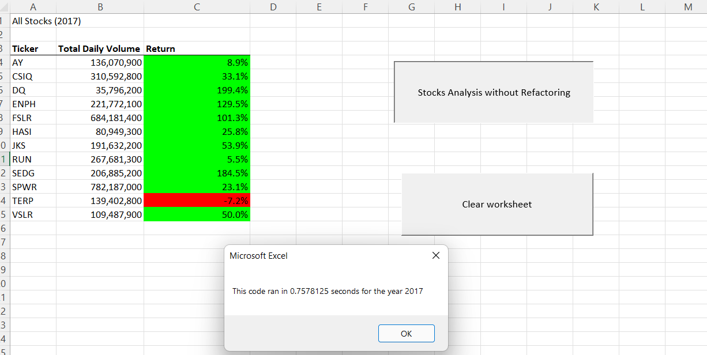
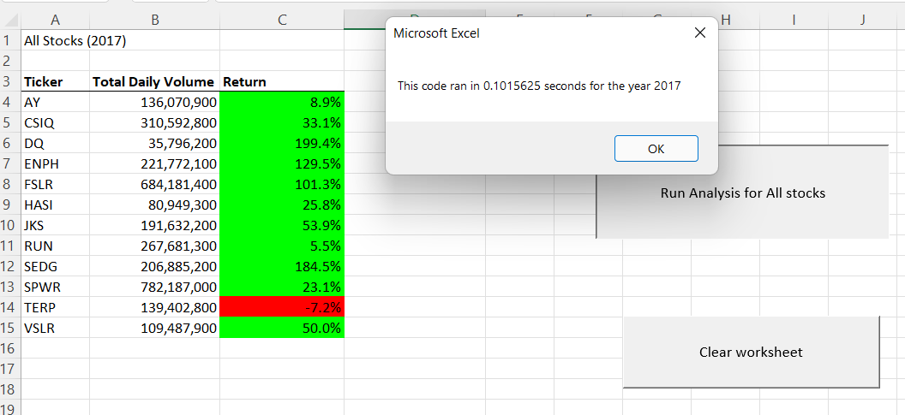
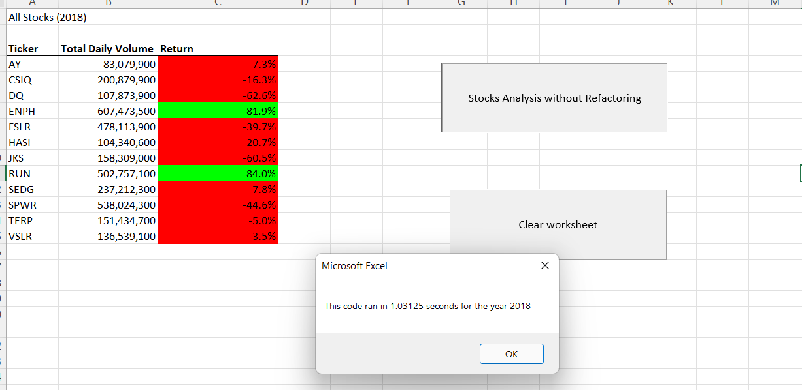

# 02_VBA_Project

## Overview of Project
The overview of the project is to analyze the stock market data set for two years - 2017 and 2018 for the following stocks:
AY,CSIQ,DQ,ENPH,FSLR,HASI,JKS,RUN,SEDG,SPWR,TERP and VSLR. We are analyzing the market start price, market ending price and total volume
for these stocks and trying to understand the return percentage using vba scripts.

## Results
original code run time for 2017

Refactored code run time for 2017

Original code run for 2018

Refactored code run for 2018

## What are the advantages or disadvantages of refactoring code?

### Advantages
The main advantage of refactoring the code are faster execution times - as shown in the analysis provided 
Time taken (in seconds) to run the 2017 spreadsheet (original code without refactoring vs Refactoring) - 0.7578125 vs 0.1015625
Time taken  (in seconds) to run the 2018 spreadsheet (original code without refactoring vs Refactoring) - 1.03125 vs  0.125

while these numbers seem smaller and not much of a time saver, When there  millions of rows present  in a data set , 
the amount of time saved would be significant with a refactored code.

### Disadvantages
One of the disadvantages of refactoring the code is that we need to understand if refactoring is really needed or not.
There can be situations where  the code can become too complex and confusing after refactoring and it takes time to re-fix it.
